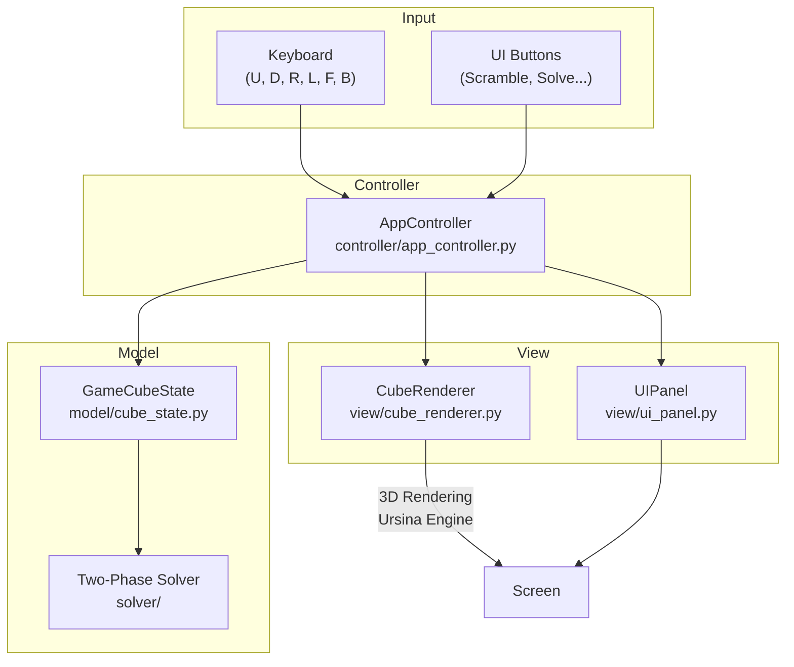
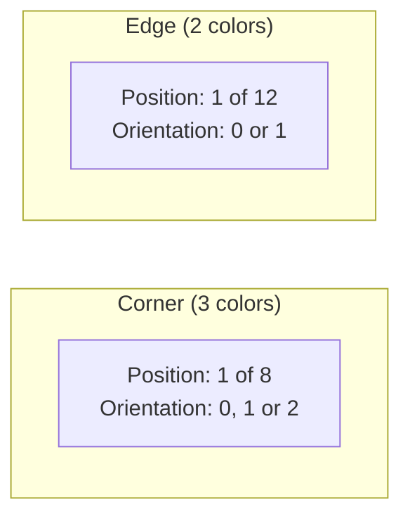
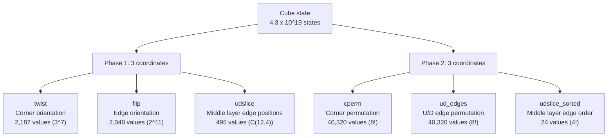
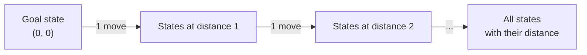
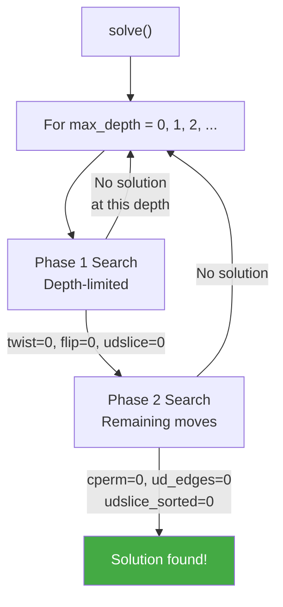
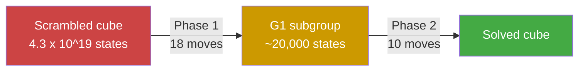
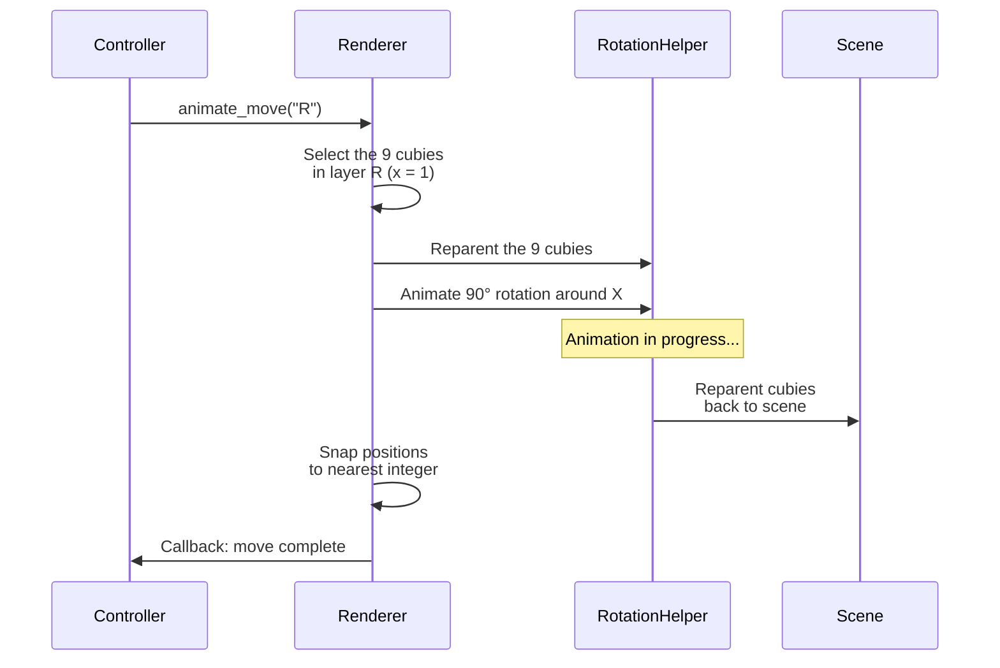

# Rubik's Cube Solver 3D

**[:fr: Version française disponible ici](README_FRENCH.md)**

An interactive 3D Rubik's Cube solver with real-time visualization and educational annotations. The project uses the **Two-Phase Kociemba algorithm** implemented entirely in pure Python (no external solving library) and the **Ursina** engine for 3D rendering.

> Average solve: **~22 moves** in **~0.19 seconds**.

---

## Table of Contents

- [Features](#features)
- [Installation](#installation)
- [Usage](#usage)
- [Project Architecture](#project-architecture)
- [How the Solver Works](#how-the-solver-works)
  - [Cube Representation](#cube-representation)
  - [Coordinate System](#coordinate-system)
  - [Move Tables](#move-tables)
  - [Pruning Tables](#pruning-tables)
  - [IDA\* Algorithm](#ida-algorithm)
  - [Phase 1: Orientation](#phase-1-orientation)
  - [Phase 2: Permutation](#phase-2-permutation)
- [3D Rendering and Animations](#3d-rendering-and-animations)
- [Performance](#performance)

---

## Features

- **Automatic solving** with the Two-Phase Kociemba algorithm
- **Interactive 3D visualization** with orbital camera
- **Educational annotations**: each move is explained in French with the current phase displayed
- **Manual controls** via keyboard (U, D, R, L, F, B + Shift for inverse)
- **4 animation speeds**: Instant, Fast, Normal, Slow
- **Playback controls**: Pause, Resume, Step-by-step
- **Random scramble** and **Undo**

---

## Installation

**Prerequisites**: Python 3.10+

```bash
git clone https://github.com/TheoEwzZer/RubiksCube.git
cd RubiksCube
pip install ursina
```

## Usage

```bash
python main.py
```

> On the first launch, solving tables are generated and cached in `solver/tables_cache/`. Subsequent launches are nearly instant.

### Controls

| Action        | Control                      |
| ------------- | ---------------------------- |
| Rotate a face | Keys `U` `D` `R` `L` `F` `B` |
| Inverse move  | `Shift` + key                |
| Orbit camera  | Right-click + drag           |
| Zoom          | Scroll wheel                 |

### Buttons

| Button            | Description                    |
| ----------------- | ------------------------------ |
| **Melanger**      | Apply 20 random moves          |
| **Resoudre (IA)** | Launch the Two-Phase solver    |
| **Reset**         | Reset the cube to solved state |
| **Annuler**       | Undo the last move             |
| **\|\|** / **>**  | Pause / Resume animation       |
| **>\|**           | Step forward                   |

---

## Project Architecture

The project follows the **Model-View-Controller (MVC)** pattern:



### File Structure

```
RubiksCube/
├── main.py                    # Entry point
├── controller/
│   └── app_controller.py      # MVC orchestration
├── model/
│   └── cube_state.py          # Logical cube state
├── view/
│   ├── cube_renderer.py       # 3D rendering (26 cubies)
│   └── ui_panel.py            # User interface
├── solver/                    # Two-Phase Kociemba algorithm
│   ├── solver.py              # Public API
│   ├── search.py              # IDA* search
│   ├── cube_model.py          # Cubie-level representation
│   ├── coord.py               # Coordinate system
│   ├── move_tables.py         # Transition tables
│   ├── pruning_tables.py      # Pruning tables (heuristics)
│   └── tables_cache/          # Generated tables cache
└── test_solver.py             # Solver tests
```

---

## How the Solver Works

### Cube Representation

A 3x3 Rubik's Cube is made up of **20 moving pieces**: 8 corners and 12 edges (centers are fixed).

Each piece has two properties:

- **Position**: where it sits on the cube
- **Orientation**: how it is rotated



The solver uses a `CubieCube` structure with 4 arrays:

| Array    | Size              | Description                                           |
| -------- | ----------------- | ----------------------------------------------------- |
| `cp[8]`  | 8 integers        | Corner permutation (which corner is at each position) |
| `co[8]`  | 8 integers (0-2)  | Orientation of each corner                            |
| `ep[12]` | 12 integers       | Edge permutation                                      |
| `eo[12]` | 12 integers (0-1) | Orientation of each edge                              |

A face move (e.g., R) is a permutation multiplication applied to these arrays.

### Coordinate System

Kociemba's key idea is to **compress** the cube state into a few integers called **coordinates**. This reduces a space of 4.3 x 10^19 possible states into much smaller, navigable spaces.



**Why two sets of coordinates?**

The algorithm splits the solve into two simpler sub-problems. Each phase works within a search space much smaller than the total state space.

### Move Tables

To avoid recomputing the effect of each move, the solver pre-computes **transition tables**:

```
table[current_state][move] = new_state
```

For example, `twist_move[1042][5]` gives the new twist value when applying move index 5 to a cube with twist 1042.

| Table                 | Dimensions  | Phase |
| --------------------- | ----------- | ----- |
| `twist_move`          | 2,187 x 18  | 1     |
| `flip_move`           | 2,048 x 18  | 1     |
| `udslice_move`        | 495 x 18    | 1     |
| `cperm_move`          | 40,320 x 10 | 2     |
| `ud_edges_move`       | 40,320 x 10 | 2     |
| `udslice_sorted_move` | 24 x 10     | 2     |

> Phase 2 only uses **10 moves** (U, U2, U', D, D2, D', R2, L2, F2, B2) because only these preserve the G1 subgroup.

### Pruning Tables

Pruning tables store the **minimum distance** (in number of moves) between a given state and the goal state. They are generated by a **Breadth-First Search (BFS)** from the solved state.



During search, if the estimated distance exceeds the remaining moves, the branch is **pruned** (cut off):

```
If estimated_distance(state) > remaining_moves -> no point continuing
```

The tables combine two coordinates for a tighter estimate:

| Pruning Table                   | Combined Coordinates      | Size   |
| ------------------------------- | ------------------------- | ------ |
| `flip_udslice_prune`            | flip x udslice            | ~1 M   |
| `twist_udslice_prune`           | twist x udslice           | ~1 M   |
| `cperm_udslice_sorted_prune`    | cperm x udslice_sorted    | ~967 K |
| `ud_edges_udslice_sorted_prune` | ud_edges x udslice_sorted | ~967 K |

The bound used is the **maximum** of the two pruning tables for each phase -- the higher the bound, the more we prune.

### IDA\* Algorithm

The search algorithm is **IDA\*** (Iterative Deepening A\*): a depth-first search with iterative deepening and heuristic pruning.



At each node of the search tree:

1. **Check** if the goal is reached (all coordinates = 0)
2. **Prune** if estimated distance > remaining depth
3. **Filter** redundant moves (no same face twice in a row)
4. **Try** each valid move and recurse deeper

### Phase 1: Orientation

**Goal**: Bring the cube into the G1 subgroup where `twist = 0`, `flip = 0`, `udslice = 0`.

Concretely, this means:

- All **corners** are correctly oriented (their U/D colors are on U or D faces)
- All **edges** are correctly oriented (no flip)
- The 4 **middle layer edges** (FR, FL, BL, BR) are in the middle slice (but not necessarily in the right place)

**Allowed moves**: all 18 basic moves (U, U2, U', R, R2, R', F, F2, F', D, D2, D', L, L2, L', B, B2, B')

### Phase 2: Permutation

**Goal**: From the G1 state, fully solve the cube (`cperm = 0`, `ud_edges = 0`, `udslice_sorted = 0`).

Concretely, this means:

- Every **corner** is in its final position
- Every **edge** is in its final position
- The middle layer edges are in the correct order

**Allowed moves**: only 10 moves that preserve G1:
`U, U2, U', D, D2, D', R2, L2, F2, B2`

> Quarter turns on R, L, F, B are forbidden because they would break the edge and corner orientation achieved in Phase 1.



---

## 3D Rendering and Animations

Rendering uses the **Ursina** engine (built on Panda3D).

### Visual Structure

The cube is made of **26 cubies** (3x3x3 minus the invisible center). Each cubie is a slightly scaled-down black cube (`scale = 0.95`) with **colored quads** on its outward-facing sides.

```
Official colors:
  U (up)    = White       D (down)  = Yellow
  R (right) = Red         L (left)  = Orange
  F (front) = Green       B (back)  = Blue
```

### Animation System

To animate a move (e.g., R face rotation):



The system manages a **queue** for move sequences, with pause/resume/step-by-step support.

---

## Performance

| Metric                          | Value    |
| ------------------------------- | -------- |
| Average move count              | ~22.2    |
| Average solve time              | ~0.19 s  |
| Max search length               | 23 moves |
| Timeout                         | 30 s     |
| First launch (table generation) | ~15 s    |
| Subsequent launches (cached)    | < 1 s    |
