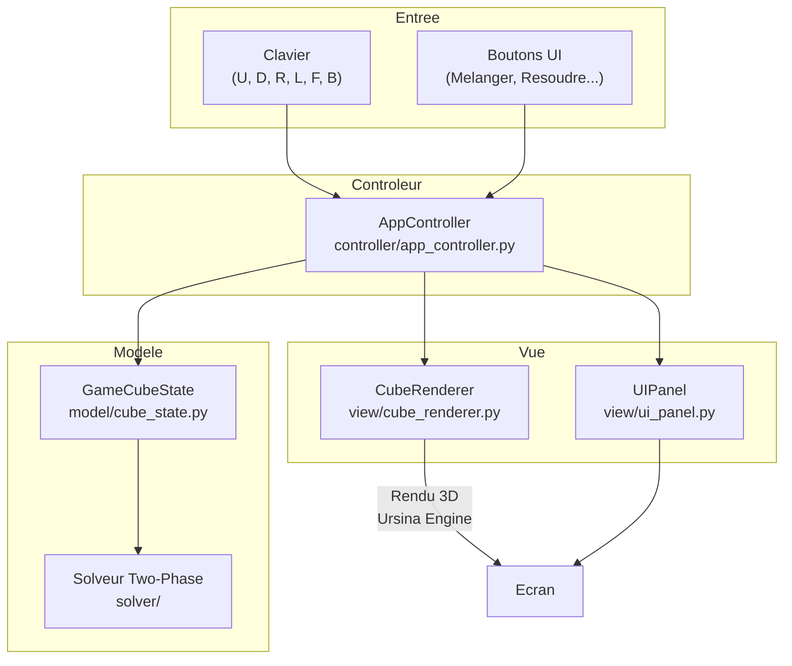
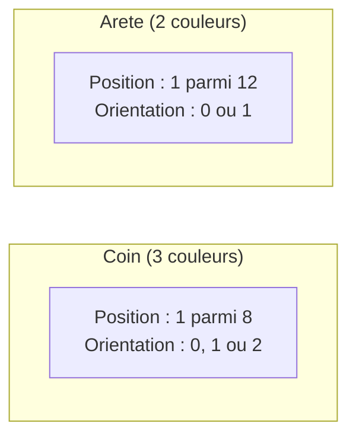
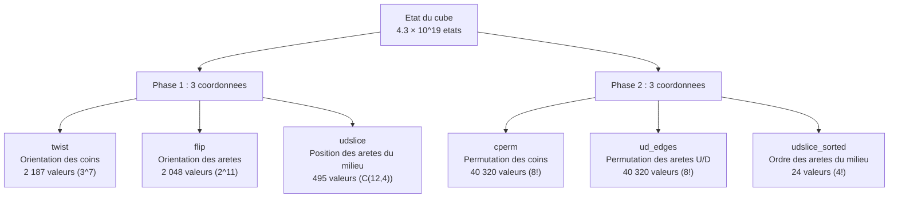
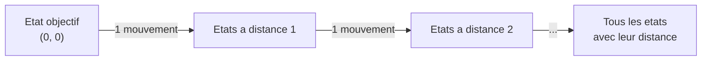
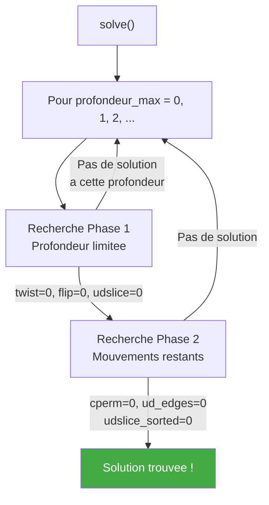
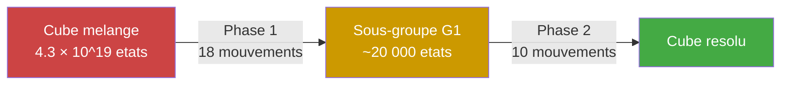
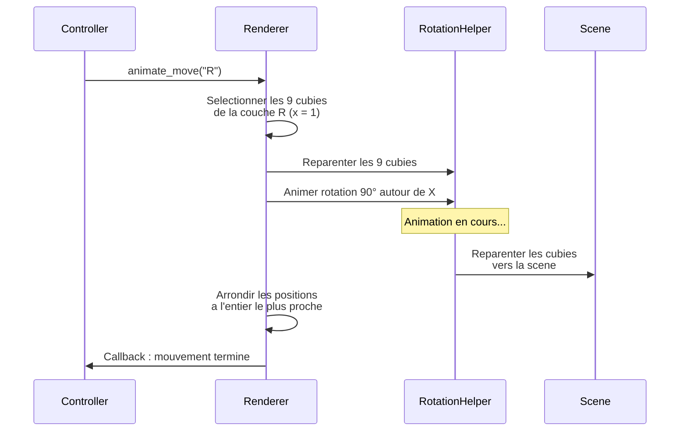

# Rubik's Cube Solver 3D

Un solveur de Rubik's Cube interactif en 3D avec visualisation en temps reel et annotations educatives. Le projet utilise l'algorithme **Two-Phase de Kociemba** implemente entierement en Python (sans librairie externe de resolution) et le moteur **Ursina** pour le rendu 3D.

> Resolution moyenne : **~22 mouvements** en **~0.19 seconde**.

---

## Table des matieres

- [Fonctionnalites](#fonctionnalites)
- [Installation](#installation)
- [Utilisation](#utilisation)
- [Architecture du projet](#architecture-du-projet)
- [Comment fonctionne le solveur](#comment-fonctionne-le-solveur)
  - [Representation du cube](#representation-du-cube)
  - [Systeme de coordonnees](#systeme-de-coordonnees)
  - [Tables de mouvements](#tables-de-mouvements)
  - [Tables d'elagage (pruning)](#tables-delagage-pruning)
  - [Algorithme IDA\*](#algorithme-ida)
  - [Phase 1 : Orientation](#phase-1--orientation)
  - [Phase 2 : Permutation](#phase-2--permutation)
- [Rendu 3D et animations](#rendu-3d-et-animations)
- [Performance](#performance)

---

## Fonctionnalites

- **Resolution automatique** avec l'algorithme Two-Phase Kociemba
- **Visualisation 3D** interactive avec camera orbitale
- **Annotations educatives** : chaque mouvement est explique en francais avec la phase en cours
- **Controles manuels** au clavier (U, D, R, L, F, B + Shift pour l'inverse)
- **4 vitesses d'animation** : Instant, Rapide, Normal, Lent
- **Controle de lecture** : Pause, Reprise, Pas-a-pas
- **Melange aleatoire** et **Annuler** (undo)

---

## Installation

**Prerequis** : Python 3.10+

```bash
git clone https://github.com/TheoEwzZer/RubiksCube.git
cd RubiksCube
pip install ursina
```

## Utilisation

```bash
python main.py
```

> Au premier lancement, les tables de resolution sont generees et mises en cache dans `solver/tables_cache/`. Les lancements suivants sont quasi-instantanes.

### Controles

| Action            | Controle                        |
| ----------------- | ------------------------------- |
| Tourner une face  | Touches `U` `D` `R` `L` `F` `B` |
| Mouvement inverse | `Shift` + touche                |
| Orbiter la camera | Clic droit + glisser            |
| Zoom              | Molette                         |

### Boutons

| Bouton            | Description                       |
| ----------------- | --------------------------------- |
| **Melanger**      | Applique 20 mouvements aleatoires |
| **Resoudre (IA)** | Lance le solveur Two-Phase        |
| **Reset**         | Remet le cube a l'etat resolu     |
| **Annuler**       | Annule le dernier mouvement       |
| **\|\|** / **>**  | Pause / Reprise de l'animation    |
| **>\|**           | Avance d'un pas                   |

---

## Architecture du projet

Le projet suit le patron **Modele-Vue-Controleur (MVC)** :



### Arborescence

```
RubiksCube/
├── main.py                    # Point d'entree
├── controller/
│   └── app_controller.py      # Orchestration MVC
├── model/
│   └── cube_state.py          # Etat logique du cube
├── view/
│   ├── cube_renderer.py       # Rendu 3D (26 cubies)
│   └── ui_panel.py            # Interface utilisateur
├── solver/                    # Algorithme Two-Phase Kociemba
│   ├── solver.py              # API publique
│   ├── search.py              # Recherche IDA*
│   ├── cube_model.py          # Representation par cubies
│   ├── coord.py               # Systeme de coordonnees
│   ├── move_tables.py         # Tables de transitions
│   ├── pruning_tables.py      # Tables d'elagage (heuristiques)
│   └── tables_cache/          # Cache des tables generees
└── test_solver.py             # Tests du solveur
```

---

## Comment fonctionne le solveur

### Representation du cube

Un Rubik's Cube 3x3 est compose de **20 pieces mobiles** : 8 coins et 12 aretes (les centres sont fixes).

Chaque piece a deux proprietes :

- **Position** : ou elle se trouve sur le cube
- **Orientation** : comment elle est tournee



Le solveur utilise la structure `CubieCube` avec 4 tableaux :

| Tableau  | Taille           | Description                                             |
| -------- | ---------------- | ------------------------------------------------------- |
| `cp[8]`  | 8 entiers        | Permutation des coins (quel coin est a quelle position) |
| `co[8]`  | 8 entiers (0-2)  | Orientation de chaque coin                              |
| `ep[12]` | 12 entiers       | Permutation des aretes                                  |
| `eo[12]` | 12 entiers (0-1) | Orientation de chaque arete                             |

Un mouvement de face (ex: R) est une multiplication de permutations appliquee sur ces tableaux.

### Systeme de coordonnees

L'idee cle de Kociemba est de **compresser** l'etat du cube en quelques nombres entiers appeles **coordonnees**. Cela reduit un espace de 4.3 × 10^19 etats possibles a des espaces beaucoup plus petits et navigables.



**Pourquoi deux jeux de coordonnees ?**

L'algorithme decoupe la resolution en deux sous-problemes plus simples. Chaque phase travaille dans un espace de recherche beaucoup plus petit que l'espace total.

### Tables de mouvements

Pour eviter de recalculer l'effet de chaque mouvement, le solveur pre-calcule des **tables de transition** :

```
table[etat_actuel][mouvement] = nouvel_etat
```

Par exemple, `twist_move[1042][5]` donne la nouvelle valeur de twist quand on applique le mouvement d'indice 5 a un cube dont le twist vaut 1042.

| Table                 | Dimensions  | Phase |
| --------------------- | ----------- | ----- |
| `twist_move`          | 2 187 × 18  | 1     |
| `flip_move`           | 2 048 × 18  | 1     |
| `udslice_move`        | 495 × 18    | 1     |
| `cperm_move`          | 40 320 × 10 | 2     |
| `ud_edges_move`       | 40 320 × 10 | 2     |
| `udslice_sorted_move` | 24 × 10     | 2     |

> La phase 2 n'utilise que **10 mouvements** (U, U2, U', D, D2, D', R2, L2, F2, B2) car seuls ceux-ci preservent le sous-groupe G1.

### Tables d'elagage (pruning)

Les tables d'elagage stockent la **distance minimale** (en nombre de mouvements) entre un etat donne et l'etat objectif. Elles sont generees par un **parcours en largeur (BFS)** depuis l'etat resolu.



Pendant la recherche, si la distance estimee depasse le nombre de mouvements restants, la branche est **elaguee** (coupee) :

```
Si distance_estimee(etat) > mouvements_restants → inutile de continuer
```

Les tables combinent deux coordonnees pour une estimation plus precise :

| Table de pruning                | Coordonnees combinees     | Taille |
| ------------------------------- | ------------------------- | ------ |
| `flip_udslice_prune`            | flip × udslice            | ~1 M   |
| `twist_udslice_prune`           | twist × udslice           | ~1 M   |
| `cperm_udslice_sorted_prune`    | cperm × udslice_sorted    | ~967 K |
| `ud_edges_udslice_sorted_prune` | ud_edges × udslice_sorted | ~967 K |

La borne utilisee est le **maximum** des deux tables de pruning de chaque phase — plus la borne est grande, plus on elague.

### Algorithme IDA\*

L'algorithme de recherche est **IDA\*** (Iterative Deepening A\*) : une recherche en profondeur avec approfondissement iteratif et elagage par heuristique.



A chaque noeud de l'arbre de recherche :

1. **Verifier** si l'objectif est atteint (toutes les coordonnees = 0)
2. **Elaguer** si la distance estimee > profondeur restante
3. **Filtrer** les mouvements redondants (pas deux fois la meme face d'affilee)
4. **Essayer** chaque mouvement valide et descendre dans l'arbre

### Phase 1 : Orientation

**Objectif** : Amener le cube dans le sous-groupe G1 ou `twist = 0`, `flip = 0`, `udslice = 0`.

Concretement, cela signifie :

- Tous les **coins** sont correctement orientes (leurs couleurs U/D sont sur les faces U ou D)
- Toutes les **aretes** sont correctement orientees (pas de flip)
- Les 4 **aretes du milieu** (FR, FL, BL, BR) sont dans la tranche du milieu (mais pas forcement a la bonne place)

**Mouvements autorises** : les 18 mouvements de base (U, U2, U', R, R2, R', F, F2, F', D, D2, D', L, L2, L', B, B2, B')

### Phase 2 : Permutation

**Objectif** : Depuis l'etat G1, resoudre completement le cube (`cperm = 0`, `ud_edges = 0`, `udslice_sorted = 0`).

Concretement, cela signifie :

- Chaque **coin** est a sa position finale
- Chaque **arete** est a sa position finale
- Les aretes du milieu sont dans le bon ordre

**Mouvements autorises** : seulement 10 mouvements qui preservent G1 :
`U, U2, U', D, D2, D', R2, L2, F2, B2`

> Les quarts de tour sur R, L, F, B sont interdits car ils casseraient l'orientation des aretes et coins obtenue en Phase 1.



---

## Rendu 3D et animations

Le rendu utilise le moteur **Ursina** (base sur Panda3D).

### Structure visuelle

Le cube est compose de **26 cubies** (3×3×3 moins le centre invisible). Chaque cubie est un cube noir legerement reduit (`scale = 0.95`) avec des **quads colores** sur ses faces exterieures.

```
Couleurs officielles :
  U (haut)    = Blanc       D (bas)     = Jaune
  R (droite)  = Rouge       L (gauche)  = Orange
  F (face)    = Vert        B (arriere) = Bleu
```

### Systeme d'animation

Pour animer un mouvement (ex: rotation de la face R) :



Le systeme gere une **file d'attente** pour les sequences de mouvements, avec support pause/reprise/pas-a-pas.

---

## Performance

| Metrique                                  | Valeur        |
| ----------------------------------------- | ------------- |
| Nombre moyen de mouvements                | ~22.2         |
| Temps moyen de resolution                 | ~0.19 s       |
| Longueur max recherchee                   | 23 mouvements |
| Timeout                                   | 30 s          |
| Premier lancement (generation des tables) | ~15 s         |
| Lancements suivants (cache)               | < 1 s         |
